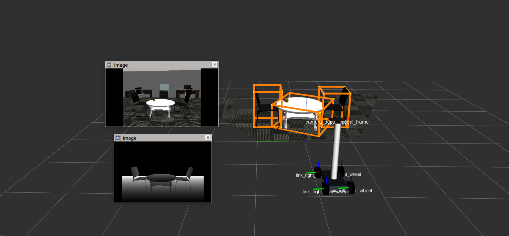
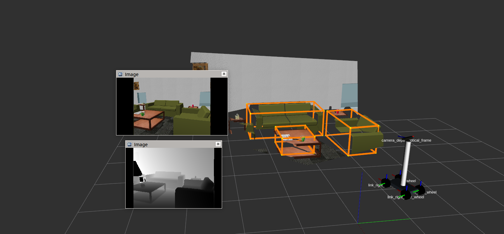
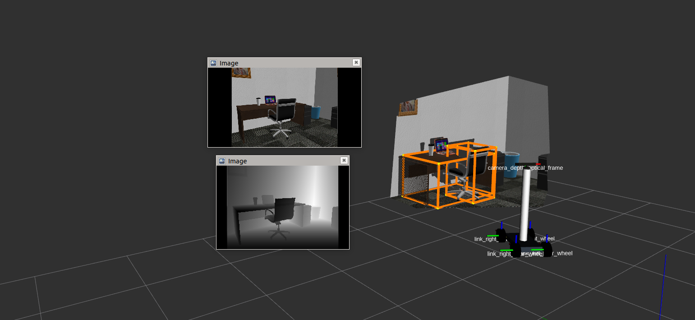

# Indoor-Object-Detection
Real-time indoor object detection using [Votenet](https://github.com/facebookresearch/votenet
) for pointclouds captured from RGB-D cameras.

## Project Brief:
 Indoor object detection is an important task in computer vision. Votenet  is  Hough  voting  based  method  
 which  votes  for  virtual  object centers and groups these votes using a vote aggregation strategy to produce 3D object  proposals. This point-based architecture  directly  processes  the  point  clouds  which 
 avoids  geometric  information  loss  due  to  quantization  that  could  be  critical in  cluttered  indoor  environments.   Votenet  achieves state-of-the art results on two large indoor datasets ([ScanNet](http://www.scan-net.org/) and [SUN RGB-D](https://rgbd.cs.princeton.edu/)).
In this work, Votenet is used to predict oriented 3D bounding boxes on point clouds captured from a KinectV2 camera in Gazebo. This code provides a bridge between the network and ROS.

## Installation Instructions:

1. Install [Ubuntu 18.04 64-bit](https://ubuntu.com/)
2. Install [ros-melodic-desktop-full](http://wiki.ros.org/melodic/Installation/Ubuntu)
3. Download gazebo models from [here](https://data.nvision2.eecs.yorku.ca/3DGEMS/) and save it under *my_worlds/models* directory.
4. Install [Gazebo9.x](http://gazebosim.org/tutorials?cat=install&tut=install_ubuntu&ver=9.0)
5. Install [PCL 1.8](https://pointclouds.org/downloads/)
6. ROS Packages:
      ```sudo apt-get install ros-melodic-ros-melodic-tf2-sensor-msgs ros-melodic-urdf ros-melodic-nav-msgs ros-melodic-sensor-msgs```


Compile the code by running catkin_make from *'simulation'* folder and source the files.

    cd ../simulation
    catkin_make  
    source devel/setup.bash

In some cases, you might be missing some ROS packages. You can download them using:
    sudo sudo apt-get install ros-melodic-<package_name>
    eg. sudo apt-get install ros-melodic-urdf

### Votenet Installation:
Please follow the instructions given [here](https://github.com/facebookresearch/votenet#installation) to install relevant votenet packages. For the purpose of this work, we used the commit [2f6d6d3](https://github.com/facebookresearch/votenet/commit/2f6d6d36ff98d96901182e935afe48ccee82d566)

Note: It's suggested that you install exact versions with [Anancoda](https://www.anaconda.com/products/individual) for seamless integration.

You might need to run the following commands to add missing packages:

    conda install -c conda-forge rospkg
    conda install -c conda-forge pyyaml
    sudo apt-get install ros-melodic-ros-numpy

Finally, compile the code using:
    
    cd ../votenet
    catkin_make
    source ./devel/setup.bash

## How to the Run Demo?

### Steps to launch the simluation environment:

**Launch any world environment from 'my_worlds/launch' folder by:**

    roslaunch my_worlds <file_name>.launch
    eg. roslaunch my_worlds  office_env_large.launch

**Spawn the robot in Gazebo by supplying XY locations:**

    roslaunch my_robot spawn.launch x:=5 y:=5

**Launch the robot model in RVIZ with specified RVIZ configuration file:**

    roslaunch my_robot rviz.launch rvizconfig:=simple_viz.rviz

If everything works fine then you should see robot model, point cloud and images of the scene.

**Publish the pointcloud for Votenet**
    
    rosrun my_robot time_sync_subscriber_node

**Robot Control: keyboard or joystick**

    rosrun my_robot teleop_twist_keyboard.py
    OR
    roslaunch teleop_twist_joy teleop.launch

Please change the joystick enable button according to your joystick in *'simulation/src/teleop_twist_joy/config/logitech.config.yaml'*.


### Steps to run Votenet in simulation
We ship a pre-trained votenet model to detect objects in indoor environments. It's placed under *'ros_votenet/scripts/votenet_model'*. 

**Run the rosified votenet for table and toilet detections by:**

    cd ../votenet
    source ./devel/setup.bash
    rosrun ros_votenet ros_votenet_detection.py 


Subscribe to "/votenet/bboxRviz" topic in RVIZ for bounding box visualisations.

## How to get results with your data?
1. Publish the point cloud on topic *"/camera/depth/points"*. This should be in up-right position (z-axis up).
2. Follow the steps to run Votenet.


## Results:





